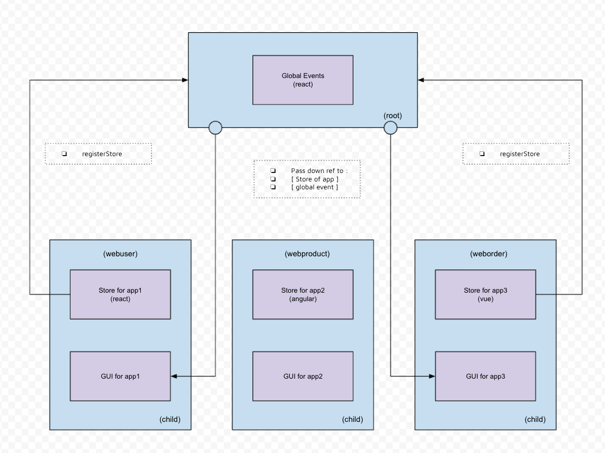

# 🔩 Micro Front Ends & More

Have you ever wondered how you can combine a Monolith project that includes an MSA style architecture? Despite their differences, can they complement each other? These are the questions I have been diving into recently.

~ THE PROBLEM :

When starting out with a project, it is often said that the monorepo architecture is a popular choice!

However, if you do decide to go this route, over time, with a fast growing company, there are a variety of challenges if you aren't careful about the way you define and structure your project's root architecture.

A couple of examples for these challenges can include ... 🤔
At the very top of the list, build time! Followed by a spider web of imports at the second place! Having to deal with placing all of your ci-cl jobs on a single pipeline comes third… Hoist issues on all those dependencies you added in package.json 😮 Oh, and I almost forgot about not being able to benefit from multiple frameworks!

Anyways, you get where this is going. These issues can also bring frustration to your team later down the road and delay that brand-new feature you’ve been trying to add. The idea behind this boiler-plate is not to say that one architecture is better than the other, as MSA still has its own set of complexities. Such as, long meetings defining protocols between teams, waiting for other teams to start working on a specific feature, models, types, and a high bill from your favorite cloud provider! AAAH! So what do we do? And can we merge the two to help us build faster services?

~ THE SOLUTION :

What about finding common ground? The question was, can these architectures be compatible to work together rather than separate? The aim was to help you build faster, benefit the most out of the technologies that glue these ideas together so that you can decide if you would rather stick to one over the other down the road. Thanks to the combination of Webpack 5 module federation for complete isolation, single spa to fuse your services together and Lerna/Turbo for any automation in your library of packages, it's possible 🙂 At the root of the project, you will find the basic Lerna/Turbo registry, with the ability to start all packages by typing : lerna/Turbo exec yarn start --parallel. Concurrency will greatly help us with this project, as it lets us start multiple processes at once. Packages 1 (Angular), 2 (React) and 3 (Vue) holds the basic micro front end apps that the “shell” package registers. Last but not least, we have the “portal” package, which holds a nav-bar and lets you switch from app to app.

When navigating between apps, the state must not be lost (because of the mount and unmount technology from single spa).
Each SPA should be self contained with its own build process.
They are individually deployable without the need to deploy the whole application. To prioritize the result of the changes you make to any individual app. (with git submodules, individual pipelines are available 🙂)
The last step was to build a shareable store across the micro apps, this is so data can pass from one framework to another. Each app hold its own complex state yet each are able to share data from a global store.

I hope you like this repo, there are always room for improvements, but it's available to you 🙂

~ THE SCRIPTS :

```shell
yarn boot # to install all deps
yarn start # to start full app
yarn start:shell # to run shell - (required)
yarn start:portal # to run portal - (required)
yarn start:app1 # to run app1 - (micro service)
yarn start:app2 # to run app2 - (micro service)
yarn start:app3 # to run app3 - (micro service)
```

~ THE ARCHITECTURE :

<br>



All the best and happy coding.

GREG
